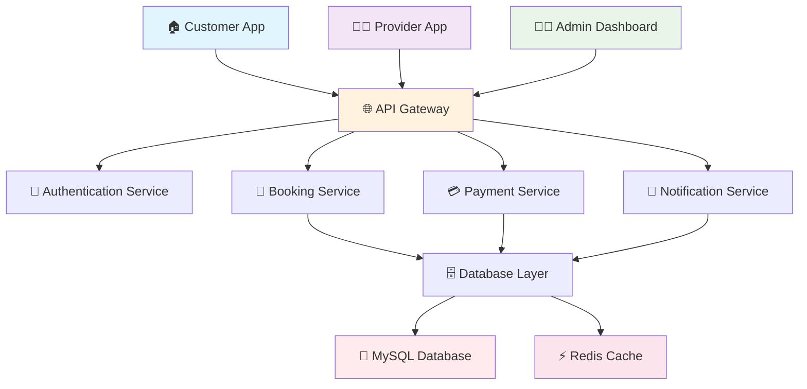

# 🎯 Smart Service Booking Management System

<div align="center">


</div>

<br>

<div align="center">
  
</div>

<br>

<div align="center">
  <h1>🚀 Revolutionizing Home & Commercial Service Booking</h1>
  <p><strong>A comprehensive, modern platform bridging the gap between professional service providers and customers.</strong></p>
  <p>Built for efficiency, scalability, and seamless user experience.</p>
</div>

<br>

<div align="center">

[](https://smart-booking-demo.example.com)
[](docs/INSTALLATION_AND_SETUP.md)
[](docs/API_DOCUMENTATION.md)

</div>

---

## 🌟 Key Features

### 🏠 **For Residential Customers**
<div align="center">

| Feature | Description |
|---------|-------------|
| 🏠 **Easy Booking** | Simple interface for plumbing, cleaning, electrical, and more |
| 📍 **Real-time Tracking** | Monitor service progress in real-time |
| 💳 **Secure Payments** | Multiple payment options with bank-level security |
| ✅ **Verified Professionals** | All service providers are background-checked and rated |
| 🌟 **24/7 Support** | Round-the-clock customer assistance |

</div>

### 🏢 **For Commercial Clients**
<div align="center">

| Feature | Description |
|---------|-------------|
| 🏢 **Enterprise Solutions** | Tailored services for offices and industries |
| 📋 **Contract Management** | Long-term service agreements and bulk bookings |
| 👤 **Dedicated Account Manager** | Personalized support for business clients |
| 📊 **Custom Reporting** | Detailed analytics and usage insights |
| ⚡ **Priority Scheduling** | Expedited service for business emergencies |

</div>

### 🛡️ **For Platform Administrators**
<div align="center">

| Feature | Description |
|---------|-------------|
| 👁️ **Complete Oversight** | Full platform control and monitoring |
| 📈 **Advanced Analytics** | Comprehensive dashboard with business insights |
| 🔍 **Worker Verification** | Robust screening and onboarding system |
| 📝 **Content Management** | Full control over service catalog and pricing |
| 💰 **Revenue Management** | Detailed financial reporting and commission tracking |

</div>

## 📚 Documentation Center

Everything you need to know about the system is organized here:

- **[🚀 Installation & Setup](docs/INSTALLATION_AND_SETUP.md)** - Get up and running in minutes.
- **[👥 User Roles & Workflows](docs/USER_ROLES_AND_WORKFLOWS.md)** - Detailed guide on Customer, Provider, and Admin features.
- **[🔌 API Documentation](docs/API_DOCUMENTATION.md)** - Integrate and extend with our robust API.
- **[🚢 Deployment Guide](docs/DEPLOYMENT.md)** - Production-ready deployment strategies.
- **[🔑 Testing Credentials](docs/TESTING_CREDENTIALS.md)** - Pre-configured accounts for testing.
- **[❓ Troubleshooting](docs/TROUBLESHOOTING.md)** - Common fixes and solutions.

---

## � System Architecture

<div align="center">



</div>

---

## 🛠️ Technology Stack

### 🎨 **Frontend Technologies**
<div align="center">

| Technology | Version | Description |
|------------|---------|-------------|
| 🎨 **TailwindCSS** | 4.0+ | Utility-first CSS framework with custom components |
| ⚡ **Alpine.js** | 3.4+ | Lightweight JavaScript for reactive components |
| 🔨 **Vite** | 7.0+ | Fast development and optimized builds |
| 🖼️ **Lucide Icons** | Latest | Beautiful & consistent iconography |
| 📊 **Chart.js** | Latest | Interactive data visualization |

</div>

### ⚙️ **Backend Technologies**
<div align="center">

| Technology | Version | Description |
|------------|---------|-------------|
| 🚀 **Laravel** | 12.0 | Modern PHP framework for web artisans |
| 🗄️ **MySQL** | 8.0+ | Robust relational database |
| ⚡ **Redis** | Latest | High-performance caching & queues |
| 🔐 **Laravel Breeze** | Latest | Authentication & scaffolding |
| 📧 **Mail Services** | Multiple | Email notifications & templates |

</div>

### 🔧 **Development Tools**
<div align="center">

| Tool | Purpose |
|------|---------|
| 🧪 **PHPUnit** | Unit & feature testing |
| 🎨 **PHP-CS-Fixer** | Code formatting & standards |
| 🐳 **Docker** | Containerization |
| 🚀 **GitHub Actions** | CI/CD pipeline |
| 📦 **Composer & npm** | Dependency management |

</div>

---

## 🚀 Quick Start Guide

### 📋 **Prerequisites**
<div align="center">

| Requirement | Minimum Version |
|-------------|-----------------|
| 🐘 **PHP** | 8.2 or higher |
| 🟢 **Node.js** | 18+ |
| 📦 **npm** | Latest |
| 🗄️ **MySQL** | 8.0+ or SQLite |
| 🔧 **Composer** | Latest |
| 📥 **Git** | Latest |

</div>

### ⚡ **Installation in 60 Seconds**

<div align="center">

```bash
# 🚀 Clone the repository
git clone https://github.com/abx15/Smart-Service-Booking-Management-System.git
cd Smart-Service-Booking-Management-System

# 📦 Install dependencies
composer install && npm install

# ⚙️ Setup environment
cp .env.example .env
php artisan key:generate

# 🗄️ Configure database
# Edit .env file with your database credentials

# 🚀 Run migrations and seed database
php artisan migrate:fresh --seed

# 🔨 Build frontend assets
npm run build

# 🌟 Start development servers
npm run start
```

</div>

### 🌐 **Access Points**
<div align="center">

| Service | URL | Description |
|---------|-----|-------------|
| 🌐 **Main Application** | http://localhost:8000 | User-facing platform |
| 📚 **API Documentation** | http://localhost:8000/api/docs | REST API reference |
| 👨‍💼 **Admin Dashboard** | http://localhost:8000/admin | Admin control panel |
| 🧪 **Testing Environment** | http://localhost:8000/test | Development testing |

</div>

---

## 👨‍💻 Developer & Maintainer

<div align="center">
  
  
  ### Arun Kumar Bind
  **Full Stack Web Developer**

_"Building digital solutions that matter."_

[](https://arun15dev.netlify.app/)
[](https://www.linkedin.com/in/arun-kumar-bind-8b5b6a22a/)
[](mailto:developerarunwork@gmail.com)

</div>

---

## 🙏 Acknowledgments

A special thanks to the open-source community:

- **Laravel Framework** for the robust foundation.
- **TailwindCSS** for the utility-first styling.
- **Lucide Icons** for beautiful iconography.

## 📄 License

This project is licensed under the MIT License - see the [LICENSE](LICENSE) file for details.
